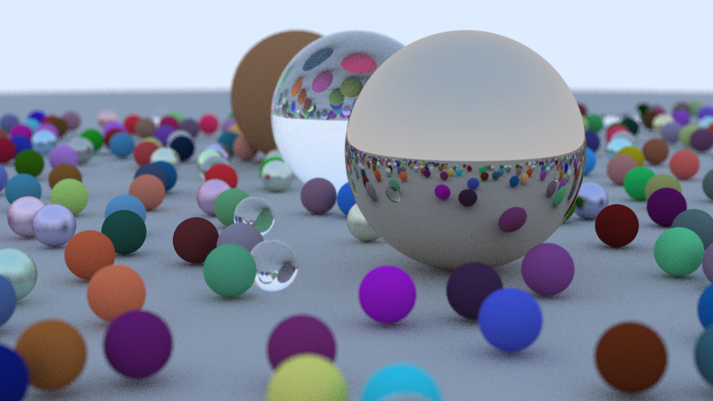

# Ray-gun
A personal implementation of ray tracing techniques in peter shirley's series of ray tracing books

This final render takes about 59 seconds at 8 samples and a ray depth of 10 bounces, 
and 513 at 100 samples with the same number of bounces.
Render times where Measured in Release mode, on a single thread.

## Upcoming Work list
[] Improved monte carlo sampling

[] bidirectional path tracing

[] disney brdf

[] denoising

[] wavefront path tracing?

[] Port to opencl

[] improve bvh

[] embree
